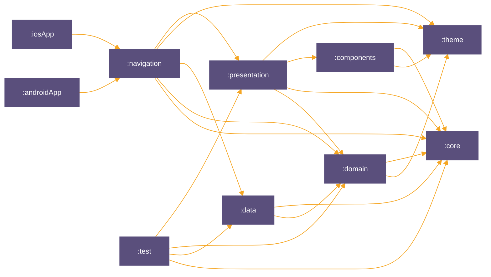

### My finances

[](https://opensource.org/licenses/Apache)

#### Screenshots

https://github.com/carlosgub/myFinances/assets/30916886/1fb1e887-5afd-4e9b-b287-ddb7be3ffb19

#### Overview

The Finance Tracker App is a versatile tool for managing your finances. Whether you want to track expenses, log incomes, or visualize your financial movements through charts, this app has got you covered. It offers a user-friendly interface and robust functionalities to help you stay on top of your finances.

#### Features

- **Expense Tracking:** Easily create, edit, and delete expenses to keep a record of your spending habits.
- **Income Logging:** Log your incomes effortlessly to have a clear picture of your financial inflows.
- **Interactive Charts:** Visualize your financial data through various charts, allowing you to analyze your spending and saving patterns.
- **Customization:** Customize categories, tags, and other parameters to tailor the app to your financial habits.
- **Data Security:** Your financial data is securely offline stored to ensure your privacy and confidentiality.
- **Platform Compatibility:** Built with Kotlin Multiplatform technology, the app works seamlessly on both Android and iOS devices.
- **Offline Functionality:** All data is stored locally on your device, allowing you to access and manage your finances even without an internet connection.
- **Unit Testing:** Comprehensive unit tests to ensure the reliability and stability of the app's codebase.

#### Technologies Used

- **Kotlin Multiplatform:** Used for cross-platform development, enabling the app to run on both Android and iOS. [GitHub Repository](https://github.com/JetBrains/kotlin)
- **Koin:** Dependency injection framework for managing dependencies in a Kotlin application. [GitHub Repository](https://github.com/InsertKoinIO/koin)
- **SQLDelight:** SQL database library for Kotlin Multiplatform projects, providing a type-safe way to interact with the database. [GitHub Repository](https://github.com/cashapp/sqldelight)
- **Kotlin-Datetime:** Library for working with dates and times in Kotlin, providing a modern and convenient API. [GitHub Repository](https://github.com/Kotlin/kotlinx-datetime)
- **Kotlin-Stdlib:** Standard library for Kotlin, providing essential functions and utilities for Kotlin development. [GitHub Repository](https://github.com/JetBrains/kotlin/tree/master/libraries/stdlib)
- **Orbit Core for MVI:** Used for implementing the Model-View-Intent (MVI) architecture, facilitating a reactive and predictable approach to UI development. [GitHub Repository](https://github.com/babylonhealth/orbit-mvi)
- **Precompose:** Used for navigation and ViewModel. [GitHub Repository](https://github.com/Tlaster/PreCompose)
- **Kotlinm-Charts:** Charting library for Kotlin Multiplatform projects, providing various chart types for visualizing data. [GitHub Repository](https://github.com/carlosgub/kotlinm-charts)
- Ktlint: Static code analysis tool for ensuring consistent coding styles across the project. Integrated into GitHub Actions for automated code style checking. This repository also is using the Compose lint rules from the slack team. [Compose Lint Rules](https://github.com/slackhq/compose-lints)
- **String Resources:** Utilize string resources for localization and easier management of text content, leveraging Kotlin Multiplatform's experimental features.
- **GitHub Actions:** Integrated GitHub Actions for continuous integration, including automated processes for running ktlint to enforce code style and executing unit tests to ensure code quality and functionality.

#### Testing
- **Kotlinx Coroutines Test:** Provides utilities for efficiently testing coroutines. [GitHub Repository](https://github.com/Kotlin/kotlinx.coroutines/tree/master/kotlinx-coroutines-test)
- **Turbine:** A small testing library for kotlinx.coroutines Flow. [GitHub Repository](https://github.com/cashapp/turbine)
- **Orbit Testing:** This library provides a simple unit testing framework for the Orbit MVI Library. [GitHub Repository](https://orbit-mvi.org/Test/new)

#### Installation

1. Clone the repository:

```bash
git clone https://github.com/carlosgub/myFinances
```

2. This project use Kotlinm-Charts so you add this variables G_USERNAME (that is your github username) and G_TOKEN (this is your token) to your environment variables. This is used in the [settings.gradle.kts](https://github.com/carlosgub/myFinances/blob/main/settings.gradle.kts):

```bash
credentials {
  username = System.getenv("G_USERNAME")
  password = System.getenv("G_TOKEN")
}
```
If you don't know how configure your token, you can read this [article](https://docs.github.com/en/packages/working-with-a-github-packages-registry/working-with-the-gradle-registry)

#### App Module Graph



#### Contributing

Contributions are welcome! If you have any suggestions, feature requests, or bug reports, please open an issue or submit a pull request.

#### Acknowledgments

- Carlos Ugaz (@carlosgub) - Maintainer

#### Design

This design is inspired by a design I found on Dribbble. I couldn't find the original post anymore, so I will post a screenshot instead.


